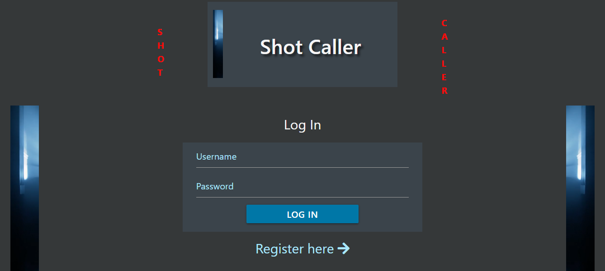
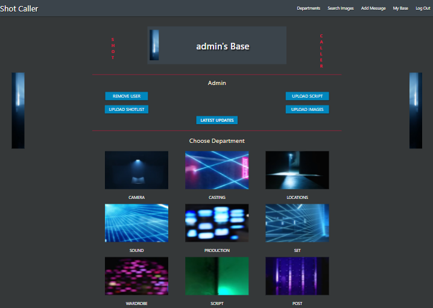
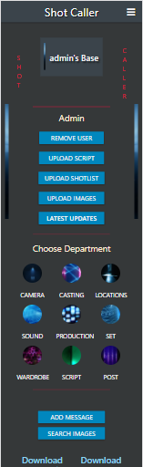
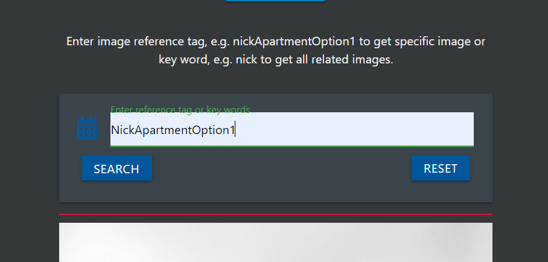
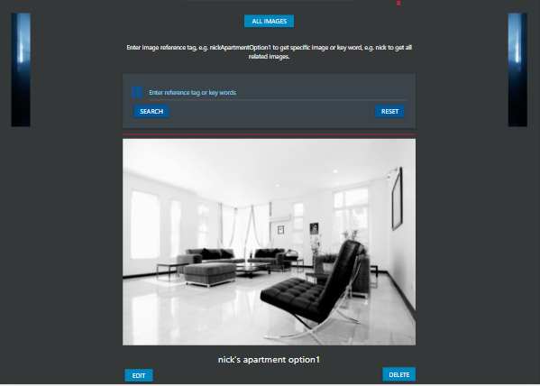

<h1 align="center">Shot Caller - Movie Production Website</h1>

[View the project live here.](https://ms3-shot-caller.herokuapp.com/)

A web application for film production that provides a reliable all encompassing
means of production collaboration from pre-production to post. The app is designed 
to provide a simple streamlined means of communication through the different 
departments channels of film production. It allows both a general and specific 
means on searching and uploading communications and images to different departments.

It has a secure admin facility for site regulation and the upkeep of the image
bank that includes a simple means of uploading the latest script, shotlist. The site 
is built with Flask using the Jinja template engine and the Werkzeug WSGI toolkit
and uses Mongodb as the back-end database.

Currently the app is limited to one production but future developements would
lead to it being turned into a piece of software that can be downloaded and used
as a product on an individual basis for each new production and owner.

<h2 align="center"></h2>

# Table of Content

- [Table of Content](#table-of-content)
- [User Experience (UX)](#user-experience--ux-)
  * [Strategy Plane](#strategy-plane)
  * [Scope Plane](#scope-plane)
  * [Structure Plane](#structure-plane)
  * [Skeleton Plane](#skeleton-plane)
  * [User stories](#user-stories)
    + [First Time User Goals](#first-time-user-goals)
    + [Returning User Goals](#returning-user-goals)
    + [Frequent User Goals](#frequent-user-goals)
- [Design](#design)
  * [Colour Scheme](#colour-scheme)
  * [Typography](#typography)
  * [Imagery](#imagery)
  * [Wireframes](#wireframes)
- [Existing Features](#existing-features)
  * [Responsive Design](#responsive-design)
  * [Login/Register Pages and Security Measures](#login-register-pages-and-security-measures)
  * [User Base Page](#user-base-page)
  * [Departments Page](#departments-page)
  * [Images Page](#images-page)
  * [Admin Page](#admin-page)
- [Database structure](#database-structure)
- [Languages Used](#languages-used)
- [Frameworks, Databases, Libraries & Programs Used](#frameworks--databases--libraries---programs-used)
- [Development platform](#development-platform)
- [Testing](#testing)
- [Testing User Stories from User Experience (UX) Section](#testing-user-stories-from-user-experience--ux--section)
  * [First Time User Goals](#first-time-user-goals-1)
  * [Returning User Goals](#returning-user-goals-1)
  * [Frequent User Goals](#frequent-user-goals-1)
- [Credits](#credits)
- [Code](#code)

<small><i><a href='http://ecotrust-canada.github.io/markdown-toc/'>Table of contents generated with markdown-toc</a></i></small>

# User Experience (UX)

The business goals are to establish the app as a reputable and reliable tool
that facilitates film production. It provides a communication platform for all 
areas of film production allowing messages, ideas and images to be sent
through each department channel. A future goal would be the development of 
of collaboratative areas for storyboarding, shotlist imaging pre-visualization.

For the user the goal of the app is to enhance and facilitate film production.
It will allow a simple and enjoyable means on departmental and inter-departmental
communication. It is streamlined for the exchange of messages by specific areas.
It will allow the user the means to instantaniously both share and recieve
ideas and all work related developements as they happen.

## Strategy Plane

The aim of the site is to create an app that facilitates film production and is on a par with the latest trends in digital communication media. It aims to be enjoyable and simple to use and become a “go to” tool in film production.
The site is designed to give the user, here being specifically the film production team, the necessary tools to communicate their ideas during production collaboration.  
Clearly separating the production process by department is key to the site’s simplicity and reliability of use where the user can fulfill their needs to find and post communications and images.
The owners of the site, here being the production team, have overall control over the site and the necessary tools, unique only to those given admin access, to update the script and the shot list and add and delete image in the image bank.
Security is a big factor in the site and only those give a key can register, the password functionality is secured through Werkzeug and the admin access id check both in the front and backend.

## Scope Plane

The features included in the app at present reflect choices made around what is absolutely necessary for the app to deliver it’s basic marketed functionality, which proposed features are buildable and what features are necessary to make
the app sellable. The buildable aspect was vital for the scope of the app and several more advance features, like a communal workspace and storyboarding facilities were repositioned as future features.

## Structure Plane

The site is structured so the user can navigate in an intuitive way through the different features, all pages keeping a uniformed consistency. 
The user is taken on a journey into the site, all elements being discoverable as they proceed along.
The User Base is central to the scructure. Here the user has a number of immediate
option tools they can click on. Or, as they are being visably encouraged to do so and
is the primary aspect to the app they can select a department. Once taken there
they are given different "find messages" choices they can follow.
They will see clear states of change when they interact with the features and be given clear feedback to assure them of their interactive success.
The information architecture is a tree structure allowing users to move through content quickly and simply becoming aware of the site’s inherent structure as they go. 

<h2 align="center">

</h2>

## Skeleton Plane

The interface is aesthetically functionally all the time creating a positive reaction in the user with every click, making the user feel both at home here and part of an exciting journey. Details of
this are found in the Design section.

[Back to Table of Content](#table-of-content)

## User stories

 - ### First Time User Goals

1. As a First Time User, I want to learn what the site has to offer and how to use the site quickly.
2. As a First Time User, I want to find communications in my or other departments.
3. As a First Time User, I want to view images.

  - ### Returning User Goals

4. As a Returning User, I want to download the latest shotlist and script
5. As a Returning User, I want to add a communication in a specific area.
6. As a Returning User, I want to edit or delete my communications.

  - ### Frequent User Goals

7. As a Frequent User, I want to view communications and see images relating to style, 
   shooting and script choices so I can develop my owm choices accordingly.
8. As a Frequent User, I want to post communications and images relating to my style, 
   shooting and script choices.
9. As a Frequent User, I want to collaborate with other user on specific areas of 
   production.

[Back to Table of Content](#table-of-content)

# Design

<h2 align="center">

</h2>

## Colour Scheme
 - The site aims to be minimal streamlined and slick using an offblack background 
   colour with blue side image panels and an offwhite text. Crimson and blue tones
   are used minimally against this for a touch of sophisticated flare especially
   the site title in crimson letters running downwards on either side of the header box.

  
## Typography
 - Materialize was used for the site and I kept their inherent font-family style 
   choice with was: -apple-system, BlinkMacSystemFont, "Segoe UI", Roboto, 
   Oxygen-Sans, Ubuntu, Cantarell, "Helvetica Neue", sans-serif. This worked perfectly
   for the style of the site.

## Imagery
 - The site was designed to have a minimal straight to business slick slightly cinematic look. This was achieved
   by the use of right and reversed left narrow side panels on an offblack background.
   The panels contain an images of a narrow window and it's blue lighting
   effect which act as a foreground to the complementing seemingly distant dark header box
   container which also has one of the images to which focus is drawn. The hope is that
   this achieves a feeling of cinematic lighting and depth.

## Wireframes

 - PDF – Balsamic was used to design the layout for login, register, user base, 
   department messages, images, and the add and admin pages.

   [View on Github](https://github.com/johnston9/MS3-Shot-Caller)

[Back to Table of Content](#table-of-content)

# Existing Features

## Responsive Design

  The site is responsive to all sizes and the images remain whole and in proportion at all sizes.

 Large Screen 1600px

<h2 align="center">

</h2>

  Medium Screen 1000px

<h2 align="center">

</h2>

 Small Screen 370px

<h2 align="center">

</h2>

[Back to Table of Content](#table-of-content)

## Login/Register Pages and Security Measures

  The user is brought first to the login page. From there they will find a 
  link to register if a new user. One of the core features of the site is it's
  built-in security measures.

  The first of which is the need for a register key to register. This will allow
  the owner of the site control over who is able to register. It would then be up to 
  them to give the necessary instructions to the user toensure that the key is not 
  further passed on. 

  As a minor security feature the login and register pages are not connected to the base
  page and the other pages.

  Werkzeug's security utilities "generate_password_hash" and "check_password_hash"
  are used run the register and login functions and ensure login security.
 
  Other security measures include front-end measures to allow admin access only to admin.
  This is backed up in the back-end ensuring only these admin functions will run if
  admin is the sesson user.

  All other functions in the back-end are protected by ensuring that there is a sesson
  user for them to run, and only registered users would be logged in and set as sesson users.

Register Page

<h2 align="center">

</h2>

[Back to Table of Content](#table-of-content)

## User Base Page

  Once loged in the user is taken to their own User Base page which is the center base
  of the site and along with all other pages had a navbar to take them to any page.
  There they have access to the different departments to view each department's communications. 
  The core feature of the site is clarity and specificy. The first measure of this is the 
  seperating of the production communications into different departments.

  This page also allows the user to download the latest script and shotlist, to add messages 
  and provides a link to take them to the images page.

User Base Department Choices

<h2 align="center">

</h2>

[Back to Table of Content](#table-of-content)

## Departments Page

  Once the user clicks on a department they are taken to that department 
  Find by Date Page. That day's communications will automatically be displaying and the 
  user has the further options of finding all communications in that
  department or finding then by date.
  They can also click on a link to take them to the Find by Poster Page where they
  can find communications by entering the poster's name.

Department Page

<h2 align="center">

</h2>

[Back to Table of Content](#table-of-content)

## Images Page
    
  The user here can find images by entering a specific image tag name if they have 
  it or entering a search word relating to the images they wish to see. These image
  are only upload by admin so they are intended to be actual style and shooting choices,
  options of these or looks the creative team are going for. Here the admin can set images for users to know what choices
  have been made and what looks and themes are being uses In turn this is the means in which the user finds out what choices have been made, i.e. actual location
  images or colour themes, and therefore devise their own choices accordingly. 
  In posting options it also allows, along with the posting of images in the Departments 
  Page for discussion and collaboration.

Images Page

<h2 align="center">

</h2>

[Back to Table of Content](#table-of-content)

## Admin Page

  As discussed above in "decurity Measures" defensive programming will only allow
  access to the admin features if admin is the sesson user and this is inplemented
  both in the front-end and back-end. If the user is admin they will be given the 
  option to delete a user, upload the latest script, upload the latest shotlist 
  or upload new images.

Admin Page 1600px

<h2 align="center">

</h2>

Admin Page 375px

<h2 align="center">

</h2>

[Back to Table of Content](#table-of-content)

# Database structure

MongoDB was used as the site's database. 

The Entity Relationship's between the users collection and the 9 seperate 
collections for each departments is on "username" and "job_title". A third relationship
is between the concatenated result of the users collection "firstname" and "lastname"
values and the department collection's "poster". These allow the automatic input 
of these user valies when a user sends a message.

The Entity Relationship's between depts and the 9 departments for dep_name allow for the
depts dep_name to be passed to app.py when a department is clicked on in the user's
base page. This sends dep_name as a variable to the get_dep function in app.py allowing
it to be used in the find() method on Mongo and get the messages for the collection of that name.
 

<h2 align="center">

</h2>

The MongoDB Shot Caller database contains the following collections.

 <strong>users</strong>- for user details

<h2 align="center">

</h2>

<strong>depts</strong>- for each department's details

<h2 align="center">

</h2>

<strong>9 department collections, e.g. camera</strong> - each containing that department's messages

<h2 align="center">

</h2>

<strong>images</strong> - for image details

<h2 align="center">

</h2>

<strong>shotlist</strong> - for the shotlist's url

<h2 align="center">

</h2>

<strong>script</strong> - for the script's url

<h2 align="center">

</h2>

# Languages Used

- [HTML5](https://en.wikipedia.org/wiki/HTML5)
- [CSS3](https://en.wikipedia.org/wiki/Cascading_Style_Sheets)
- [JAVASCRIPT](https://en.wikipedia.org/wiki/JavaScript)
- [PYTHON](https://en.wikipedia.org/wiki/Python_(programming_language))
- [JINJA](https://en.wikipedia.org/wiki/Jinja_(template_engine))

# Frameworks, Databases, Libraries & Programs Used

1. [Materialize:](https://materializecss.com/getting-started.html)
   - Materialize was used to create the overall framework and it's grid based 
     format for the site and it's primary responsiveness. Also specific 
     Materialize features were used throughout which include the, collapsable, 
     the navbar and sidenav, the modals, the tooltipped feature, the datepickers
     and the overall styling of the website.
1. [Flask:](https://en.wikipedia.org/wiki/Flask_(web_framework))
   - Flask was used along with python to build then site's backend framework and
     run the app.
1. [Werkzeug:](https://werkzeug.palletsprojects.com/en/1.0.x/)
   - Flask used Werkzeug to the application to speak with the webserver and 
     for security purposes mainly with regard to the users's password.
1. [Jinja:](https://en.wikipedia.org/wiki/Jinja_(template_engine))
   - Flask used the Jinja template engine to build the front-end of the app.
1. [MongoDB:](https://en.wikipedia.org/wiki/MongoDB)
   - MongoDB was used as the app's backend database.
1. [Pymongo:](https://pypi.org/project/pymongo/)
   - Pymongo was used for interacting with MongoDB database from the app.
1. [Font Awesome:](https://fontawesome.com/)
   - Font Awesome was used throughout the website for the arrow navigation and
     a number of other icons.
1. [jQuery:](https://jquery.com/)
   - jQuery was used along with javascript to initialize the Materialize features.
1. [Git](https://git-scm.com/)
   - Git was used for version control by utilizing the Gitpod terminal to commit to Git and Push to GitHub.
1. [GitHub:](https://github.com/)
   - GitHub is used to store the projects code after being pushed from Git.
1. [Balsamiq:](https://balsamiq.com/)
   - Balsamiq was used to create the [wireframes](https://github.com/johnston9/MS3-Shot-Caller) during the design process.
1. [Freeformatter](https://www.freeformatter.com/html-formatter.html)
   - Freeformatter was used to tidy up the final code.
1. [Gauger](https://gauger.io/fonticon/)
   - Gauger was used to create the favicon icon.
1. [Am-I-Responsive](http://ami.responsivedesign.is/):
   - Am I Responsive was used to test the site's responsive sizings and to generate responsive sizing images.
1. [GitHub Wiki TOC generator:](http://ecotrust-canada.github.io/markdown-toc/)
   - GitHub Wiki TOC generator was used to create the Table of Contents.

# Development platform

1. [Gitpod:](https://www.gitpod.io/docs/)
   - Gitpod was used as the development platform.

[Back to Table of Content](#table-of-content)

# Testing

W3C Markup Validator, W3C CSS Validator. PEP8 and JSHint were used to validate every page of the project.

- [W3C Markup Validator](https://validator.w3.org/) - [Results](https://github.com/johnston9/MS3-Shot-Caller)
  - W3C "Direct Input" option was used on each html page. As Jinja was used throughout the site
    errors displayed where it was used on each page but no other error displayed.
    When I validated by URL no errors were shown as seen in the screenshot "W3C entire site by URL"

- [W3C CSS Validator](https://jigsaw.w3.org/css-validator/#validate_by_input) - [Results](https://github.com/johnston9/MS3-Shot-Caller)
  - W3C showed no errors and only one warning for the hr rule's background colour
    being the same as it's colour, which was intentional.

- [JSHint](https://jshint.com/) - [Results](https://github.com/johnston9/ms2-apis)
  - JSHint was used with "New JavaScript features (ES6)" and "jQuery" checked in the configuration menu.
    All files were clear of errors and warnings.
    
- [PEP8 online check](http://pep8online.com/) - [Results](https://github.com/johnston9/MS3-Shot-Caller)
  - PEP8 approved the app.py page and all python apart from saying "no newline at end of file"
    but I researched this and found it was a common result and could be ignored.

[Back to Table of Content](#table-of-content)

# Testing User Stories from User Experience (UX) Section

## First Time User Goals

1. As a First Time User, I want to learn what the site has to offer and how to use the site quickly.

    1. The site is designed for first time learning. It is streamlined for specicic
       user goals that after first use are so simple that with a few clicks after entering
       the site the user will be able to get to any specific area or tool. At the top of the 
       User Base Page and throughout the site the navbar displays all options for the user
       so they can select their desired destination quickly.
    2. Upon entering the user is taken to their home base and greeted with image
       links for each production department and the message to "Choose Department".
       Upon clicking on a department they are taken to that departments "Find by Date Page"
       where that day's communications are automatically showing.
       They are given further choices to find all messages or go to the "Find by Poster Page".
       The user will become automatically aware of what is on offer and how to find a particular
       field in a few click. The user will see the choices on offer and learn how best 
       to use them for their needs.
    3. Below the departments on the User Base Page the user will see further options
       to add messages, search images, download the script or download the shotlist.
    
<h2 align="center">

</h2>

2. As a First Time User, I want to find communications in my or other departments.

    1. Upon opening a department page the user will see the latest messages displayed.
       They will see the option to open all messages and a more specicic option
       to find messages by a particular date.
    2. The user will see a further option to go to "Find messages by Poster" and on clicking
       they will be taken to the "Find messages by Poster Page" where they can get all messages
       from a particular team member by typing in their full name as instructed.
    3. The user will see all chosen messages each displaying,in the header the name and position
       of the poster, the subject and whether it is a priority or not. On clicking on a message box
       it will open to show the message and an image if one has been posted.

<h2 align="center">

</h2>

3. As a First Time User, I want to view images.

    1. In the navbar and on their home base the user will see a link to search images
       which on clicking will take them to the images page.
    2. The user will see instruction on how to search for images. They can use a specicic
       image reference tag, if thet have one or they can input search words relevent
       to what they are looking for.
    3. The image bank is uploaded by the production team only so only contains sanctioned
       images of style choices, locations and other images all in keeping with the choices
       set by the team or different options that are being worked on or considered.

Specific reference tag input

<h2 align="center">

</h2>

Specific reference tag result

<h2 align="center">

</h2>

Result for query word "nick"

<h2 align="center">

</h2>

[Back to Table of Content](#table-of-content)

## Returning User Goals

4. As a Returning User, I want to download the latest shotlist and script.

    1. On clicking download script the script is downloaded to the user's device.

    1. On clicking download shotlist the shotlist is downloaded to the user's device.

Result for downloaded script

<h2 align="center">

</h2>

Result for downloaded script

<h2 align="center">

</h2>

5. As a Returning User, I want to add a communication in a specific area.

    1. Upon entering 
    2. Upon entering 
    3. Upon entering 

6. As a Returning User, I want to edit and delete my communications.

    1. Upon entering 
    2. Upon entering 
    3. Upon entering 

[Back to Table of Content](#table-of-content)

## Frequent User Goals

7. As a Frequent User, I want to view communications and see images relating to style, 
   shooting and script choices so I can develop my owm choices accordingly.

    1. Upon entering 
    2. Upon entering 
    3. Upon entering 

8. As a Frequent User, I want to post communications and images relating to my style, 
   shooting and script choices.

    1. Upon entering 
    2. Upon entering 
    3. Upon entering 

9. As a Frequent User, I want to collaborate with other user on specific areas of 
   production.

    1. Upon entering 
    2. Upon entering 
    3. Upon entering 

- The app was tested on Google Chrome, Internet Explorer, and Safari browsers.

- The app was viewed on a variety of devices such as Desktop, Laptop, iPhone and various other smartphones.

- Friends and family members were asked to review the site and to point out any bugs and/or user experience issues. These were taken on board and changes were made if necessary or to give a better user experience.

### Known Bugs

- All bugs to date have been dealt with.
[Back to Table of Content](#table-of-content)

# Repository
   [Github](https://github.com/)
   - Github was used as the repository for the project.

### Forking the GitHub Repository

By forking we make a copy of the GitHub Repository.

1. Log in to GitHub and locate the [GitHub Repository](https://github.com/johnston9/MS3-Shot-Caller)
2. At the top of the Repository just above the "Settings" button on the menu, click the "Fork" Button.
3. This will create a copy of the original repository in your GitHub account.

### Making a Local Clone

1. Log in to GitHub and locate the [GitHub Repository](https://github.com/johnston9/MS3-Shot-Caller)
2. Under the repository name, click "Clone or download".
3. To clone the repository using HTTPS, under "Clone with HTTPS", copy the link.
4. Open Git Bash.
5. Set the current working directory to the location where you want the cloned directory to be made.
6. Type git clone, and then paste the URL copied above.
7. Press enter and a local clone will be created.

Click [Here](https://help.github.com/en/github/creating-cloning-and-archiving-repositories/cloning-a-repository#cloning-a-repository-to-github-desktop) to retrieve pictures for some of the buttons and more detailed explanations of the above process.

# Deployment

[Heroku](https://www.heroku.com/platform)
   - Heroku was used to deploy the project.

### Create the Flask app

In the terminal use the following commands:

#### pip3 install Flask

#### touch app.py
app.py is where the python logic to run the app is written.

#### touch env.py
In env.py set the app's environment variables and keys needed during development.
These will later be set in Heroku.

import os
os.environ.setdefault("IP", "0.0.0.0")
os.environ.setdefault("PORT", "5000")
os.environ.setdefault("SECRET_KEY", "***************")
os.environ.setdefault("MONGO_URI", "***********")
os.environ.setdefault("MONGO_DBNAME", "shot_caller") 

#### touch pycach.py 

#### touch gitignore
gitignore is used to store sensitive variables and keys that do not get sent to github.
Type pycach.py and env.py in the gitignore file.

#### pip3 freeze --local > requirements.txt 
A requirements.txt containing all Flask dependencies is needed for Heroku to run the app.

#### echo web: python app.py > Procfile
This tells Heroku what language the app is using.

#### pip3 install flask-pymongo
So Flask can communicate with Mongo install 'flask-pymongo'.

#### pip3 install dnspython
We also need to install 'dnsython' in order to use the Mongo SRV connection string.

#### pip3 freeze --local > requirements.txt
Heroku needs to know these are needed for the app.

#### Push everything to Github

### Set up Heroku

Register a Heroku account.
Click 'Create a New App'.
Where asked select "Europe" as the region then click create app.

Click Settings then click Reveal Config Vars.
Now set the variables and keys to those in env.py.

IP, with the value of 0.0.0.0. 
PORT, which is 5000.
SECRET_KEY, copy then paste it from env.py. 
MONGO_URI, get this when 'Connect your Application’ is clicked on in Mongo connect area. 
MONGO_DBNAME, shot_caller.

THEN CLICK HIDE CONFIG VARS

Back in Deploy choose Github then click Search to get the correct Github repo for the app
then click connect.

Click Enable Automatic Deployment then click Deploy Branch.

Click "View" to launch the app.

[Back to Table of Content](#table-of-content)

# Credits

## Code

- [W3schools.com](https://www.w3schools.com/howto/howto_js_scroll_to_top.asp): Here I learnt how to create the return to top function.
- The general structure of the app was inspired by Tim Nelson's Task Manager app
  which is part of the Code Institute's course.

### Content

All content was written by the developer.

### Media

The nine images used for the departments in this site were all created by myself 
using a small portion of different screenshots I took from the TV series "Arrow" 
created by "The CW Network", USA and the TV series "Gotham" created by "The Fox Broadcasting Company", USA.

These are only being used for the MS3 project and will be replaced if the app is
to be made in any way public.

The images used in the sites image bank and sent by ficticious users are also from the above.

I researched the topic of copyright when it comes to the use of screenshots of tv shows
used for non-profit student purposes and although it is somewhat of a grey area the
general consensus is that it come under the "Fair Use Doctrine". Also in terms
of the 4-factor balancing test that it is accessed under the usage in this project is fair.

See documentation for more info in copyright.docx.

### Acknowledgements

- I'd like to thank the Code Institute tutor team for their support and my mentor 
Aaron Sinnott for his insights and clarity.

[Back to Table of Content](#table-of-content)

